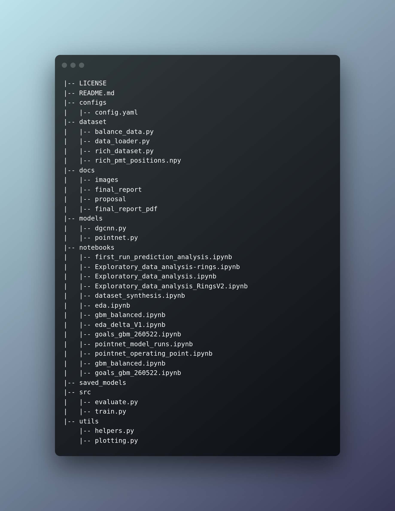

# TRIUMF RICH AI

First and foremost, a big warm welcome! :balloon::tada: :confetti_ball: :balloon::balloon:

The 2022 RICH AI Capstone Project is completed at the University of British Columbia Master of Data Science programme in collaboration with [TRIUMF](https://www.triumf.ca/), Canada's particle accelerator centre and one of the world's leading subatomic physics research institutions.

This document (the README file) is a hub to give you some information about the project. You can either get straight to one of the sections below, or simply scroll down to find out more.

- [TRIUMF RICH AI](#triumf-rich-ai)
  - [About this project](#about-this-project)
  - [Contributors](#contributors)
  - [Report](#report)
  - [Project Structure](#project-structure)
  - [Dependencies](#dependencies)
  - [Dataset](#dataset)
  - [Configuration file](#configuration-file)
  - [Model Training](#model-training)
  - [Model Evaluation and Scoring on new data](#model-evaluation-and-scoring-on-new-data)
  - [References](#references)

## About this project

The NA62 experiment at CERN (European organization for nuclear research) studies the rate of the ultra-rate meson decay into a pion to verify the Standard Model in physics. The aim of this project is to develop a binary classification model based on advanced Machine Learning (ML) to distinguish pion decays from muon decays using the output of the Ring Imaging Cherenkov (RICH). The challenge lies in concurrently increasing the pion efficiency and mion efficiency and surpassing the performance of the MLE algorithm.

The data used to build the machine learning models had 2 million examples, controlled for momentum and converted to point cloud form by the addition of a time dimension. Two deep learning models were applied: PointNet and Dynamic Graph CNN (DGCNN). Both were built using the point clouds of hits, particle momentum and the ring radius computed using the MLE. The best performing PointNet model used all these features, with a time delta of 0.2 ns and 16 epochs of training. Likewise the best performing DGCNN used all the features, k = 8 nearest neighbors and a  time delta of 0.3. The overall best performing model was PointNet as it has the highest AUC ROC, exceeds the pion efficiency from the MLE estimate for all momentum bins, and maintains a low muon efficiency for momentums beyond 34 GeV/c. Meanwhile, the DGCNN is able to maintain a similar pion efficiency but fails to maintain an adequate muon efficiency to surpass the MLE estimate.

## Contributors

- [Nico Van den Hooff](https://www.linkedin.com/in/nicovandenhooff/)
- [Rakesh Pandey](https://www.linkedin.com/in/rakeshpandey820/)
- [Mukund Iyer](https://www.linkedin.com/in/mukund-iyer19/)
- [Shiva Jena](https://www.linkedin.com/in/shiva-jena/)

## Report

The final report can be accessed [here](https://github.com/TRIUMF-Capstone2022/richai/jupyter-book/final_report/).

## Project Structure



## Dependencies

Project was developed using `singularity` containers with the following package dependencies.

- pandas==1.3.5
- torch==1.11.0
- sklearn==0.24.0
- jupyterlab
- pyyaml==6.0

## Dataset

The data was generated as part of the 2018 NA62 experiments performed at CERN. There are a total of 11 million labeled decay events, each containing the features detailed above. However, there is a large class imbalance in the data set. Only 10% of the examples are of pions, the class of interest. More details can be [here](#report).

Sub directory `dataset` has script for creating RICH daaset and train, validation and test loader.

- `rich_dataset.py` processes raw HDF5 format and extracts events, hits and position data.
- `dataloader.py` loads data (train/test/validation) in batches as feed into the neural networks.

Dataset configuration can be controlled and customized using the `dataset` section of [configuration file](#configuration-file).

## Configuration file

The configuration file contains all of the parameters for the dataset, filters, model training, and scoring.
File `configs/config.yaml` can be used to control datset paths, filters, model parameters/hyperparameters, train/test/saved model paths, dataloader configurations such as batch size, number of workers, etc., number of training epochs, device id, and many more.

> Before beginning the training process, double-check that the configuration, such as datset and model paths, is correct.

## Model Training

To train PointNet use the following command.

```bash
python src/train.py --model pointnet
```

To train `Dynamic Graph CNN` use the following command.

```bash
python src/train.py --model dgcnn
```

> The trained model object can be found in the path specified in `configs/config.yaml` as `model.model_name>.saved_model`.

## Model Evaluation and Scoring on new data

To evaluate `PointNet` on test data or to score on a new data, use the following command.

```bash
python src/evaluate.py --model pointnet
```

To evaluate `Dynamic Graph CNN` on test data or to score on a new data, use the following command.

```bash
python src/evaluate.py --model dgcnn
```

> Model scored csv data can be found in the path specified in `configs/config.yaml` as `model.model_name>.saved_model`. It contains actual labels, predicted labels, and predicted probabilities.

## References

- G Anzivino, M Barbanera, A Bizzeti, F Brizioli, F Bucci, A Cassese, P Cenci,R Ciaranfi, V Duk, J Engelfried, and others. Light detection system and time resolution of the na62 rich. Journal of Instrumentation, 15(10):P10025, 2020.
- The beam and detector of the NA62 experiment at CERN. Journal of Instrumentation, 12(05):P05025–P05025, may2017. 
  URL: https://doi.org/10.1088%2F1748-0221%2F12%2F05%2Fp05025, doi:10.1088/1748-0221/12/05/p05025.
- Max Jaderberg, Karen Simonyan, Andrew Zisserman, and others. Spatial transformer networks. Advances in neural information processing systems, 2015.
- Charles R Qi, Hao Su, Kaichun Mo, and Leonidas J Guibas. Pointnet: deep learning on point sets for 3d classification and segmentation. In Proceedings of the IEEE conference on computer vision and pattern recognition, 652–660. 2017.  
- Yue Wang, Yongbin Sun, Ziwei Liu, Sanjay E Sarma, Michael M Bronstein, and Justin M Solomon. Dynamic graph cnn for learning on point clouds. Acm Transactions On Graphics (tog), 38(5):1–12, 2019.