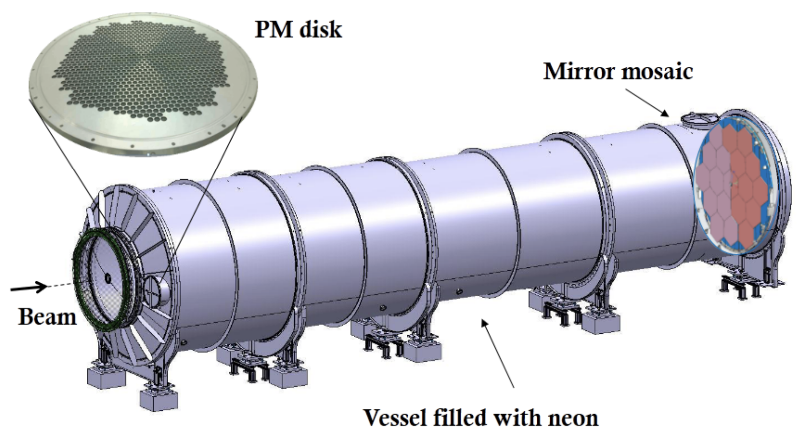
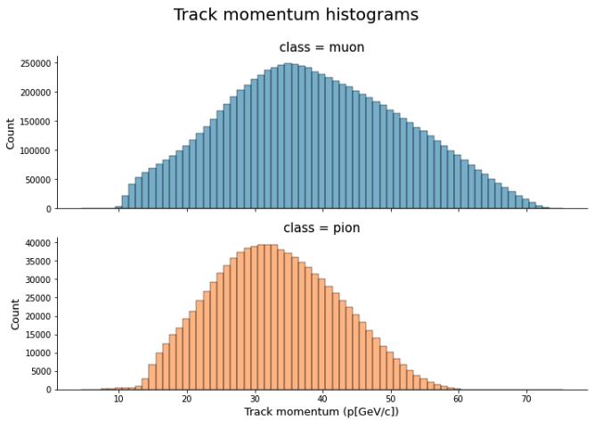
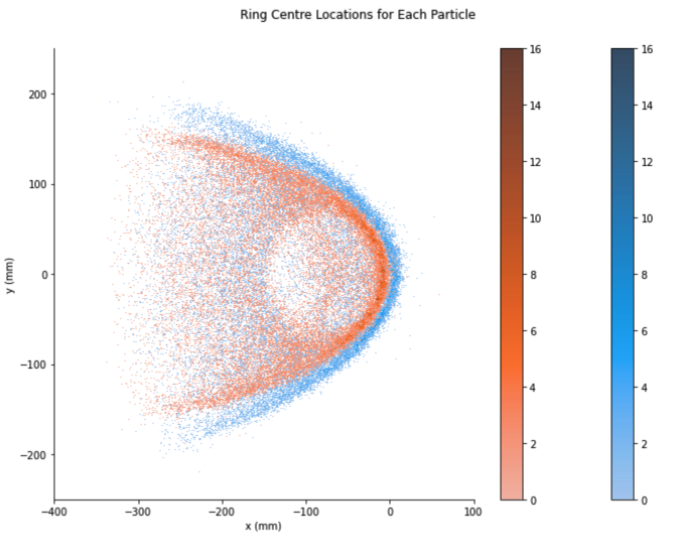
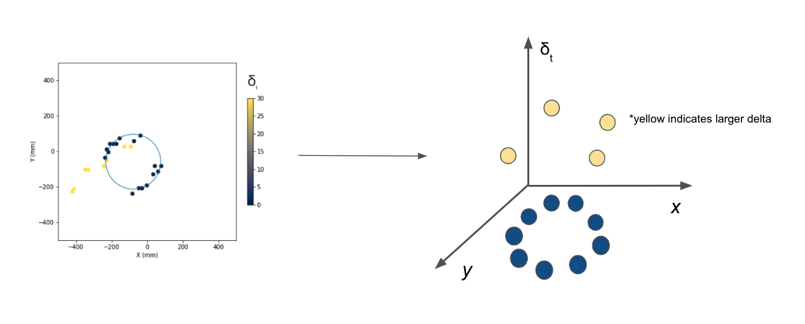

# Data Generation #

In order to generate the NA62 data, several experiment "runs" are performed.  For each run, the experiment configuration is fixed and the following steps are performed:

1. A beam rich in kaon particles is delivered in “bursts” every four or five seconds into the detector. The set up as shown in Figure 1.

2. During a burst, several particle decays occur.  Each particle decay has an individual “event” ID associated with it.
3. The product of the decay is accelerated through a chamber of neon gas in the RICH detector and a cone of light is emitted.  The RICH detector is shown in Figure 2 [@anzivino2020light].

4. The cone of light is reflected by a mosaic of mirrors onto an array of photomultiplier tubes (“PMT”).  In an ideal situation, the cone of light forms a “ring” on the PMT array.
5. Each individual PMT in the array records whether or not it was hit by light, as well as the time of arrival for each hit of light.
6. The hodoscope counters (CHOD) detector shown in Figure 2 records the time that the particle decay occurs.

Based on the experimental setup detailed above, two sets of features associated are derived for each event. The first set corresponds to the subatomic particle motion: the particle momentum and time spent in the detector (CHOD time). The second set of features are derived from the light emitted by the subatomic particle motion. Each photon detected by a PMT tube is recorded as a hit on the PMT grid with X and Y coordinates relative to this grid and the time of the hit. As an abstraction to the hit scatter, the ring radius and center that result from the MLE fit that TRIUMF currently employ are also included. All in all, there are a total of 5 features for each event. 

## Data volume ##

The data was generated as part of the 2018 NA62 experiments performed at CERN.  There are a total of 11 million labeled decay events, each containing the features detailed above. However, there is a large class imbalance in the data set. Only 10% of the examples are of pions, the class of interest.  

## Preprocessing ##

### Subsampling w/ respect to momentum bins ###

The class imbalance will be detrimental to achieving a high pion efficiency as the pion is the minority class. Undersampling the muons to match the number of pions was a feasible solution to address this issue due to the large dataset. However, random sampling of muons examples cannot be used for this data. This is due to the systematic difference in the distribution of momentums between the two particles and is purely an artifact of the experimental setup as seen in Figure 3. This will bias the output as the objective of this project is to carry out the classification strictly based on differences in the ring size between the particles. The solution was to split the data into three equally sized bins by momentum in the range of 15-45 GeV/c2, count the number of pions in each bin, and sample an equal number of muons within that bin. The resulting synthetic dataset contained 2 million examples. 
There were enough examples to feed into the machine learning models, and momentum as a feature was controlled. 

### Debiasing w/ respect to ring center bias ###

Similarly, Figure 5 details the difference in the ring centers computed using the MLE between the two classes. As this feature is an abstraction of the scatter of X and Y coordinates, it can be inferred that the bias exists in the raw hits information which will be fed into the deep learning models. These models identify this spatial difference on the standardized PMT grid, and therefore bias the classification. Demeaning each of the hits data using the global X and Y positions of the ring centers, irrespective of class, will remove this bias.

### Point cloud generation ###

Naturally, the photon hits information for each event is a system of X and Y coordinates that exists in a 2D plane. As the number of hits for an event usually ranges from 15-30, and the PMT grid is of size 1952, the information is very sparse when treated as a standard image. Hence the photon hits information was converted to a point cloud by adding a third dimension of time: the absolute value of the difference between the photon hit time and the particle travel. This is an eloquent solution as noise hits will have a large value in this new dimension and therefore be separated from the ring produced by the genuine motion of the particle. 

