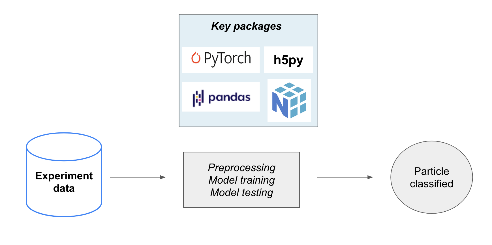
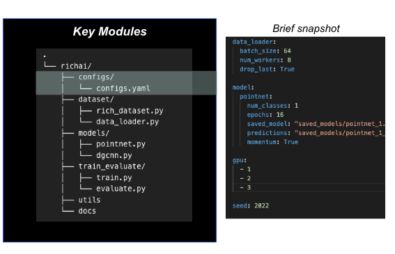
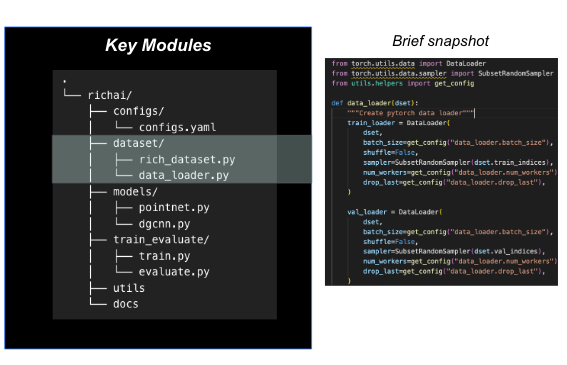
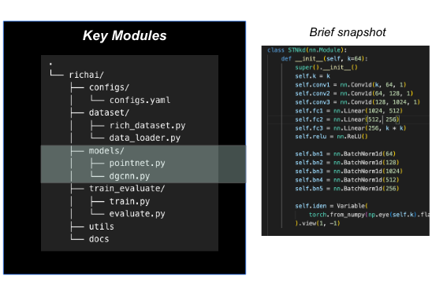
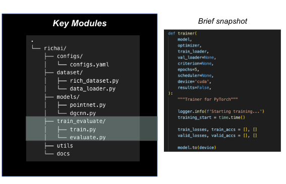

# Data Product

## Product overview
Our data product is a machine learning pipeline that takes in the experiment data in HDF5 format, pre-processes them, prepares training data, trains classifier models on the training data and evaluates model results on test data through modular scripts. 
An overview of the product along with key library dependencies is shown in the image below:

_Product Overview_


## Modules and usage of the product
The product has one script to run all the models and generate results. All the codes are built into modules. The modules and a snapshot of the associated scripts or sub-modules are shown in the following sections.

### config
The product has all the controls built in the `config` module. It has the control parameters wherein the user can control model parameters/ hyperparameters such as train/test/saved model paths, dataloader configurations such as batch size, number of workers, etc., number of epochs for training, device id, and many more. 



### dataset
`dataset` has two sub-modules:
- `rich_dataset.py` processes raw HDF5 format and extracts events, hits and position data.
- `dataloader.py` loads data in batches as feed into the models



### models
`models` has the architecture built in for the two deep learning models PointNet and DGCNN.


### train
`train` has modules for training and evaluating the model results.


### others
`utils` has helper functions to generate some plots for usage by user.
`docs` has proposal and final reports.

## Pros and Cons
Pros:
- PointNet and DGCNN have high pion efficiency at higher operating points
- Easy to configure using the config module
- Modular codes allow flexibility in tweaking the architecture in future, if needed.

Cons:
- Models require long training time and high computing power with multiple GPUs due to their inherent architecture. 

Hence, further optimization may be tried by hyperparameter tuning and/or experimenting with the architectures of the two models. Due to time constraints and limitations of producing a working product, further improvements could not be built in. Although there may not be huge scope for improvement in these model results in terms of pion and muon efficiences, hyperparameter tuning or experimenting with the model architectures may be tried as future course of action in improving the product performance.


```python

```
